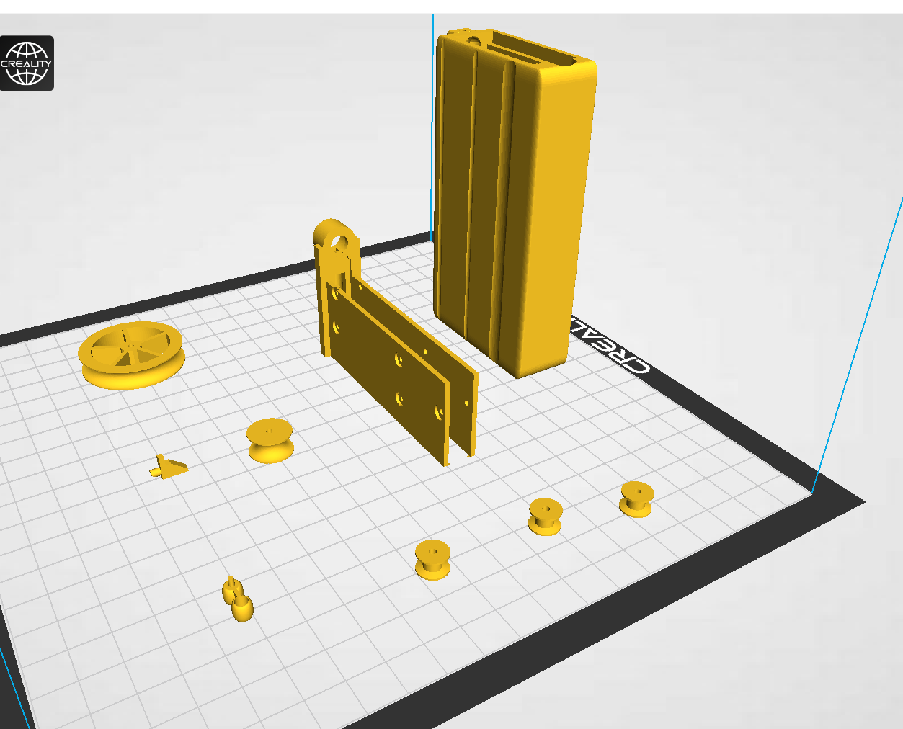

3d printable m4 airsoft magazine

### Feaures

- Capacity 39 BBs 

- Durable design

- Lightweight at 64g

- Low cost per magazine

- Full magazine indicator

### Requirements

- Blender 2.9

### Build

- Open magazine.blend file in blender.

- Move to scripting mode.

- Run script (takes around one minute to build)

### Get STL-files already build

[Files from Thingiverse](https://www.thingiverse.com/thing:5466770)

### Videos

[Youtube, magazine overview video](https://youtu.be/Fpss9nV4ZOA)

[YouTube, magazine assembly video](https://youtu.be/4C9eRvLlT90)

### Pictures

